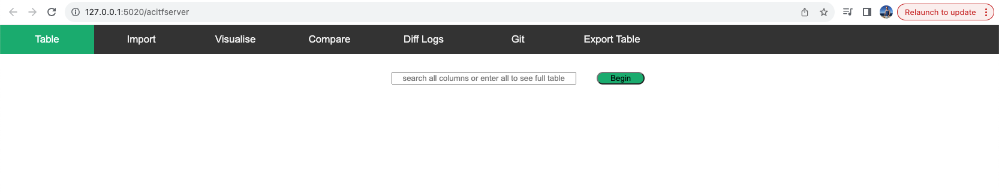
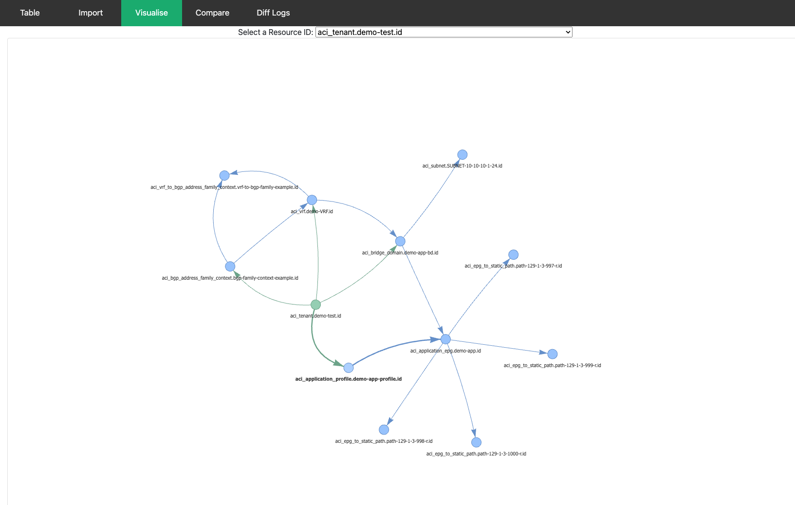

# ACI Terraform Server

The ACI Terraform server is a project which provides searchability and visibility to ACI (DevNet & NetAsCode) Terraform files. In addition, when using visualise module, resources interdependencies are displayed in a dependence diagram.

# Feature/Functionality

* Table searching using input selection.
* Generates differential outputs each time the database is updated, allowing users to track changes efficiently.
* Enables users to compare versions and generate detailed diff outputs for enhanced visibility.
* Creates dependency diagrams for a given resource, showcasing its dependencies within the network architecture.

# Prerequisites

Please ensure that you have the following prerequisites and dependencies in place

* Python 3.9 (or higher): The project is built on Python, and it requires version 3.9 or higher to run successfully.
* MongoDB: A MongoDB instance is essential for storing and managing the imported Terraform data.
* Poetry: Poetry should be utilized to set up package dependencies.

```bash
pip install poetry
```

* Git: Git is required for installing the code.

# Installation Instructions

Clone the repo
```bash
git clone https://github.com/atxit/aciTerraformServer.git
```
Go to your project folder
```bash
cd aciTerraformServer
```
Install poetry project dependencies. 
```bash
poetry install
```
set python path (if needed)

to verify 
```bash
echo $PYTHONPATH
```
if nothing is returned, set using:
```bash
. set_python_path.sh
```

Ensure MongoDB is up and running.

```bash
make start
```

Click http://127.0.0.1:5020/acitfserver to access the project's web interface.

Once you have access, checkout my YouTube video https://youtu.be/82LW_qfmCuA on how to navigate the project or review the "how to" guides found within the howTo directory (located within this repository)






