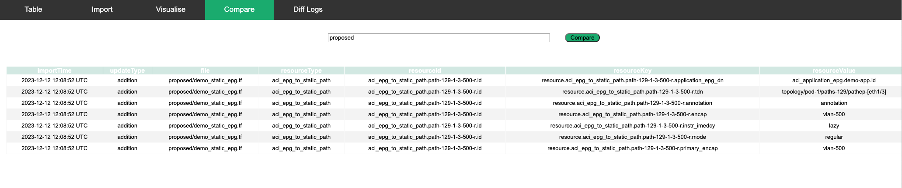

## User Guide: Compare Tab

Use the compare tab to create a change diff when comparing a proposed change against the existing database. 
Proposed folder location: “/path/to/your/folder/aciTerraformServer/proposed”

Note: change "/path/to/your/folder" so it matches your environment. 

* Enter example to compare .tf files from the example folder.
* Enter proposed to compare.tf files from the proposed folder.
* Or Enter a full path to another folder which contains .tf files

Note: diff output is not saved to the diff database. 