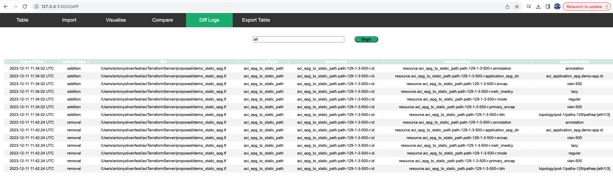
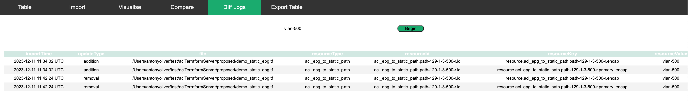

User Guide: Diff Log Tab

Each time the import process executes, the diff module will compare the incoming table against the outgoing table. If change is detected, a set of diff records will be generated. 

Input "all": In the designated search field, enter the keyword "all."

Enter “all” to display all records. Alternatively, enter a search value.

