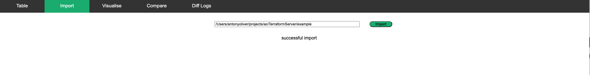
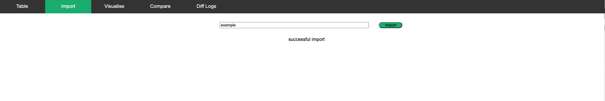
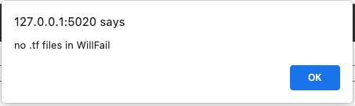

## User Guide: Import Tab

Use the import tab to import the .tf files. 

* Enter the folder location of the files. 
* If no files have been previously imported, the import input field will be blank. 
* Only use the absolute or full path.


The example folder is found at /path/to/your/folder/aciTerraformServer/example. 

Note: change '/path/to' so it matches your environment.

Enter example to import .tf files from the example folder
Enter proposed to import .tf files form the proposed folder.



Or



Successful import message:


Or 




Alternatively, use bash to import the TF files (run from the root of this repo and set PYTHONPATH)

```bash
poetry run python3 ../source/import_aci_tf.py – f /path/to/aciTerraformServer/example
```


