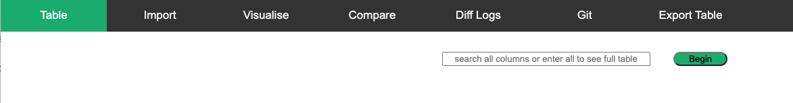
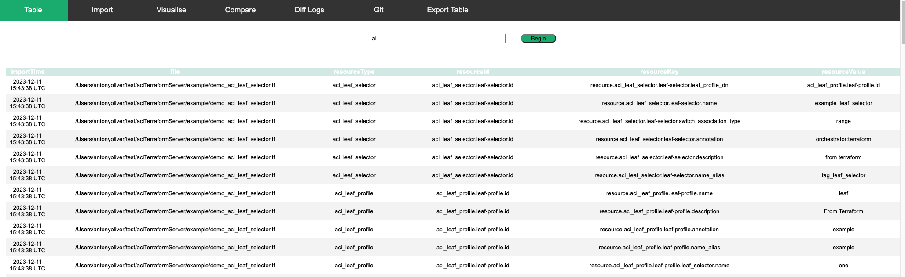
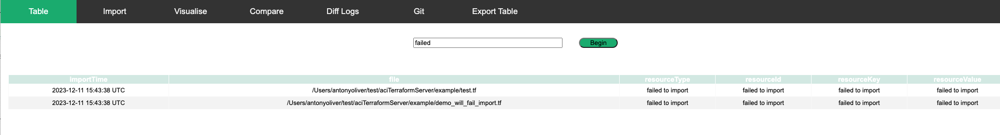
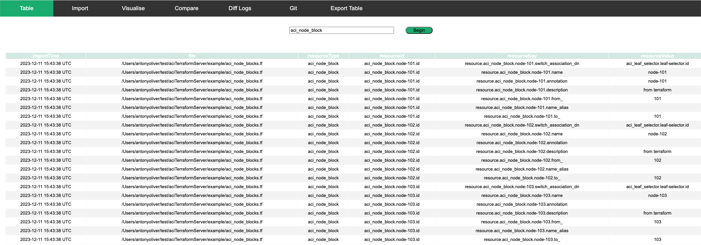
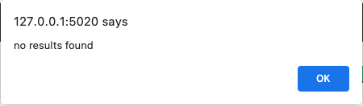
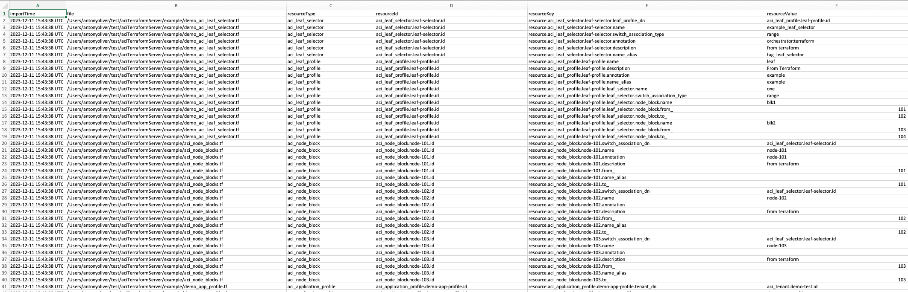

## User Guide: Table Tab

The Table Tab offers users convenient access to tabulated HCL files. To begin searching, please follow these steps:

1.	Import Data: Before initiating a search, use the "Import" button to populate the table with the necessary HCL files.

2.	Search Functionality: Once the table is populated, utilise the search functionality to efficiently locate specific information within the HCL files.

Input "all": In the designated search field, enter the keyword "all."

Data should be displayed. 

In the designated search field, enter the keyword "failed.". Failed import records will be displayed (if any). Please check the file for errors. 

In the designated search field, enter the search keyword. 

All columns will be searched. Searching is not case-sensitive and will return a row if the input search value is contained within the cell. 

If no results are found:

Click the export button to export the table to .csv

