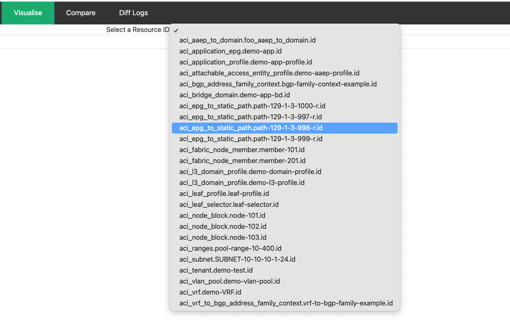
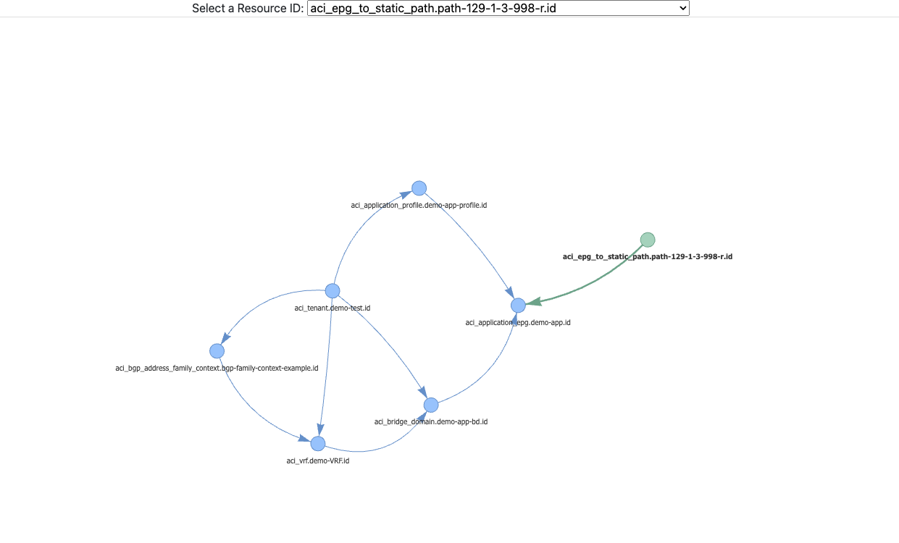
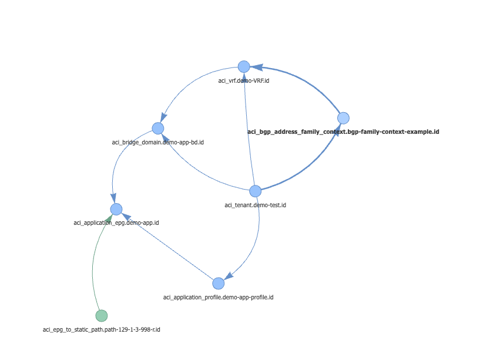

## User Guide: Visualise Tab

There can be a vast number of interdependencies between ACI resources. This complexity can become overwhelming when attempting to piece everything together. The visualisation tool creates dynamic resource dependency paths in the form of a diagram, enabling users to visualise these intricate connections.

Note: Only resources that contain a dependency are listed.

Start by selecting a resource from the list

Once selected, a resource dependency path map will be generated.

Note: The selected resource is highlighted in green, while its dependents are presented in blue. Zoom in and out to better view the diagram, depending on the number of displayed resources. 

Drag the diagram to move the resources into different positions.

